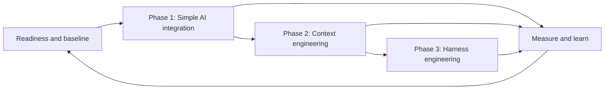

# Adoption Model

## Purpose

The adoption model helps a software organization increase AI assistance without creating an uncontrolled collection of tools, prompts, and one-off automations. Each phase adds a capability that depends on the previous one:

The model is deliberately evidence-gated. A team may progress faster or slower than another team, and an organization should not declare itself "in Phase 3" based on a single advanced pilot.

## Operating Cycle

Use the same operating cycle at every phase:

1. Select a bounded, valuable workflow and a willing team.
2. Record a baseline for delivery, quality, developer experience, and relevant risks.
3. State the hypothesis, allowed tools and data, success measures, owner, and stop conditions.
4. Enable the team with training, examples, office hours, and an escalation route.
5. Observe work in normal delivery conditions rather than in an isolated demonstration.
6. Review the evidence, decide whether to adapt, stop, repeat, or expand, and publish the learning.

This cycle turns adoption into a portfolio of controlled experiments. It avoids both extremes: waiting for a perfect enterprise strategy and scaling an appealing demo before its risks and value are understood.

## The Phases

| Capability | [Phase 1: Simple AI integration](phase-1-simple-ai-integration.md) | [Phase 2: Context engineering](phase-2-context-engineering.md) | [Phase 3: Harness engineering](phase-3-harness-engineering.md) |
| --- | --- | --- | --- |
| Primary question | Can people use AI assistance safely and effectively in their everyday work? | Can assistance use reliable, relevant organizational context? | Can proven AI-enabled workflows operate repeatedly with controls and evaluation? |
| Unit of change | Individual and team habits | Shared knowledge and context products | End-to-end workflow and platform capability |
| Typical examples | Drafting tests, explaining unfamiliar code, summarizing incidents, preparing reviews | Curated architecture context, repository instructions, searchable approved knowledge, task briefs | AI-assisted pull request workflow, evaluated coding agents, issue-to-change pipelines, observability and policy controls |
| Main failure mode | Unreviewed output and uneven skill | Stale, excessive, or untrusted context | Automating an unreliable workflow without evaluation or accountability |
| Evidence to advance | Consistent use, retained accountability, no unacceptable risk, useful measured outcomes | Context is owned, current, accessible, and demonstrably improves task quality | Repeatable results, defined controls, evaluations, operational ownership, and rollback paths |

## Readiness Before Phase 1

Readiness is not a separate transformation phase. It is the minimum foundation for a responsible pilot:

- A senior sponsor can remove organizational blockers and accept the pilot's decisions.
- An adoption lead coordinates learning, measurement, and communication.
- Security, privacy, legal, procurement, and architecture stakeholders have a named route for guidance and escalation.
- The selected team has a stable enough workflow to establish a baseline.
- The organization can identify what data and code may be shared with approved tools.
- The pilot has time for practice and review, not only a demand to "be more productive."

If one of these conditions is missing, reduce the pilot's scope or resolve the gap before onboarding more teams.

## Progression Gates

Advancement is a decision made with evidence, not a calendar event.

### Enter Phase 1

- The pilot has a documented objective, owner, boundaries, and stopping conditions.
- Participants know approved tools, data-handling rules, and their review responsibilities.
- The team has a lightweight baseline and a way to capture feedback and incidents.

### Advance to Phase 2

- Participants use the Phase 1 practices on real work rather than only in training.
- The organization has examples of useful workflows and known limitations.
- Review, security, and quality controls still catch issues at an acceptable rate.
- The next constraint is lack of reliable context, not lack of basic skill or tool access.

### Advance to Phase 3

- Important context has an owner, a freshness expectation, access rules, and a retrieval or delivery mechanism.
- Teams can demonstrate that grounded assistance improves relevant work without degrading quality or security.
- Candidate workflows are repeatable enough to define inputs, outputs, success criteria, and exceptions.
- Platform and security owners can support the required integrations and controls.

### Scale a Harness

- The harness has an accountable product and operational owner.
- It has task-level evaluations, quality and safety checks, auditability, and a way to stop or roll back automation.
- Its results are monitored in ordinary delivery work, including failures and exceptions.
- Expansion is justified by measured value and support capacity, not tool novelty.

## What to Measure

Do not compress AI adoption into one productivity number. Capture a small, balanced set of measures and compare them with a meaningful pre-pilot baseline:

| Dimension | Example signals |
| --- | --- |
| Flow | Lead time, cycle time, review latency, time spent finding information |
| Quality | Escaped defects, test coverage changes, rework, review findings, rollback rate |
| Developer experience | Confidence, friction, learning time, perceived usefulness, cognitive load |
| Risk and trust | Policy exceptions, data handling incidents, security findings, inaccurate or unsafe output caught in review |
| Adoption health | Trained participants, active use on appropriate tasks, repeated workflows, support demand |

Use qualitative evidence alongside metrics. Interviews and work samples often reveal that a faster task merely moved effort into review, debugging, or coordination.

## Accountabilities

| Role | Core responsibility |
| --- | --- |
| Executive sponsor | Sets outcome boundaries, funds enablement, resolves cross-functional decisions, accepts scale decisions. |
| Adoption lead | Runs the learning loop, maintains the roadmap, publishes evidence, and coordinates stakeholders. |
| Engineering and delivery leads | Choose work, protect time for practice, uphold review standards, and interpret local results. |
| Engineers and practitioners | Use approved tools responsibly, validate outputs, share reusable practices, and report failure modes. |
| Platform, security, privacy, legal, and architecture partners | Define guardrails, integrations, risk treatment, and escalation paths appropriate to the organization. |

No role delegates accountability to an AI system. The point of the model is to clarify who owns the changed work system as capabilities grow.

## Portfolio View

Run a small number of pilots across different work types, such as feature delivery, maintenance, testing, incident response, and documentation. Give each pilot an explicit phase, owner, hypothesis, and evidence record. A central adoption group should consolidate lessons and reusable assets, while teams retain the autonomy to decide whether a workflow fits their local context.

The desired outcome is a capability ladder: individual fluency first, shared trusted context second, and operable workflow harnesses last.

[Back to the repository overview](../README.md)