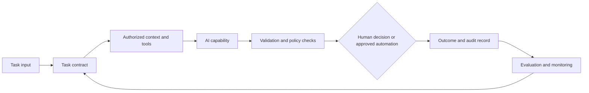

# Long Term: Harness Engineering

## Outcome

The long-term horizon turns a proven AI-assisted workflow into an operable capability. A harness is the software, process, and controls around an AI capability that make a specific task repeatable, observable, and safe enough to use at scale.

The objective is not maximum autonomy. The objective is a workflow that produces useful results under known conditions, detects when those conditions do not hold, and hands decisions back to accountable people or systems.

## What a Harness Is

A harness surrounds a model with the parts needed to perform one bounded job responsibly:

A model call by itself is not a harness. Nor is a chat prompt copied between people. The harness defines what task is being attempted, which information and actions are permitted, how success is judged, and what happens when the system is uncertain or fails.

## Qualify the Workflow First

Build a harness only for work that has earned it through short-term fluency and medium-term trusted context. A good candidate has:

- A clear and recurring outcome, such as drafting a change plan, triaging a well-defined class of issue, preparing test cases, or checking a pull request against explicit standards.
- Inputs, outputs, constraints, and exceptions that can be described without relying on hidden expert intuition alone.
- Trusted context with known owners, freshness expectations, and access boundaries.
- An observable definition of quality, safety, and usefulness.
- A human or system owner who can accept, reject, escalate, or roll back the result.
- Enough volume or risk reduction to justify engineering and operating the harness.

Do not build a harness to compensate for unclear requirements, a broken delivery process, unsupported tools, or missing source ownership. Automation will amplify those weaknesses.

## Core Components

| Component | Responsibility | Questions to answer |
| --- | --- | --- |
| Task contract | Defines the supported job and its boundaries. | What inputs are valid? What output is expected? What must be refused or escalated? |
| Context and capabilities | Supplies approved knowledge and scoped integrations. | Which sources and tools are needed? Who authorizes them? What is the least privilege needed? |
| Orchestration | Sequences deterministic steps, AI calls, tool use, and checkpoints. | Which steps must remain deterministic? What can retry? What is idempotent? |
| Validation | Checks structure, factual grounding, policy, quality, and task-specific rules. | What must pass before a result is visible or actionable? |
| Human interaction | Requests clarification, approval, or override at meaningful decision points. | Who can approve? What information do they need to judge the result? |
| Evaluation | Tests capability quality before and after changes. | Which representative cases prove that the workflow still works safely? |
| Observability | Records behavior, cost, latency, failures, and outcomes. | Can the owner explain what happened and diagnose degradation? |
| Operations | Provides ownership, release management, incident response, and retirement. | Who supports it? How is it rolled back, disabled, or decommissioned? |

Keep the task contract narrow. A reliable harness that proposes test cases for one service boundary is more valuable than a generic "engineering agent" whose responsibilities, permissions, and quality bar are unclear.

Use the [harness design review template](../templates/harness-design-review.md) to make these decisions reviewable before implementation.

## Engineering Principles

### Keep the Deterministic Shell Strong

Use conventional software for permissions, input validation, data transformation, workflow state, retry rules, logging, schema checks, and policy enforcement. Use an AI capability where interpretation, generation, classification, or constrained reasoning creates material value.

The more important the control, the less it should depend on a model following prose instructions. For example, enforce authorization in the integration layer rather than asking the model not to access a system.

### Make State and Side Effects Explicit

Separate planning, proposing, and acting. Record task state and idempotency keys for any workflow with side effects. Require confirmation or an approved policy path before modifying code, creating external records, sending communications, or triggering deployment behavior.

### Design for Refusal and Escalation

Every harness should recognize conditions it does not support: missing context, contradictory sources, low-confidence classification, policy conflicts, unexpected tool responses, or potentially sensitive data. Route those cases to a human with the evidence needed to decide, rather than forcing a plausible output.

### Version Everything That Changes Behavior

Track task contracts, prompts or instructions, context sources, schemas, evaluation sets, tool configurations, policy rules, and model settings. A behavior change without a version trail cannot be evaluated or safely rolled back.

## Build in Thin, Evaluated Slices

Use a progression that proves the harness before it gains scope or authority:

| Stage | What happens | Gate to proceed |
| --- | --- | --- |
| Offline prototype | Run representative historical or synthetic cases with no live side effects. | The task contract, evaluation set, and baseline quality are credible. |
| Shadow mode | Process live-like inputs while people complete the normal workflow independently. | Results add value without missed safety or quality conditions. |
| Assisted mode | Present proposals, evidence, and controls to a human who decides. | Users can efficiently review, override, and escalate outcomes. |
| Constrained action | Perform a narrow, reversible action under explicit policy and monitoring. | Authorization, auditability, rollback, and failure handling work in practice. |
| Wider rollout | Expand to more teams or cases with support capacity and ongoing measurement. | Value, reliability, and operational ownership hold across representative conditions. |

Do not skip shadow mode for a workflow with meaningful customer, production, compliance, financial, or security impact unless a risk owner explicitly accepts an equivalent validation approach.

## Evaluation Is a Product Feature

Evaluation is how a harness earns and retains trust. Build a small, maintained task-level evaluation set before broad rollout.

| Evaluation type | Purpose | Example |
| --- | --- | --- |
| Contract evaluation | Confirms output shape and required fields. | A proposed change includes affected files, assumptions, tests, and unresolved questions. |
| Grounding evaluation | Confirms use of correct and authorized sources. | A design summary cites the current ADR rather than an obsolete ticket. |
| Quality evaluation | Assesses task usefulness against a rubric or known answer. | Review findings identify real policy violations without overwhelming reviewers with noise. |
| Safety evaluation | Exercises prohibited, ambiguous, and adversarial cases. | The harness refuses or escalates a request involving unapproved sensitive data. |
| Operational evaluation | Checks latency, cost, retries, availability, and degradation. | The workflow falls back cleanly when an integration is unavailable. |

Include normal cases, edge cases, cases with incomplete context, and cases that must be rejected. Re-run evaluations whenever task logic, source data, model configuration, tool permissions, policy, or integrations change materially.

Avoid using a model as the sole judge of its own output. Where automated judging is useful, calibrate it against human review and retain task-specific deterministic checks.

Capture baseline, variant, and regression evidence with the [evaluation record template](../templates/evaluation-record.md).

## Security, Privacy, and Reliability Controls

The harness is a new system boundary. Apply ordinary engineering controls as well as AI-specific ones:

- Authenticate users and services; authorize every context source and tool action with least privilege.
- Keep secrets outside prompts, logs, evaluation fixtures, and model-visible state unless a reviewed design requires otherwise.
- Validate all external input, tool responses, and structured output at the boundary.
- Use sandboxing, allowlists, timeouts, rate limits, quotas, and reversible operations for external actions.
- Treat retrieved content and tool output as data, not instructions that may override policy or task boundaries.
- Log enough metadata to reconstruct material outcomes without storing unnecessary sensitive content.
- Define data retention, deletion, vendor, and residency controls appropriate to the organization's obligations.
- Provide a kill switch, fallback procedure, and incident route before enabling consequential actions.

Controls should make the supported path easy. Requiring staff to work around cumbersome safeguards is a sign the harness or policy needs redesign.

## Observability and Operations

Monitor both technical behavior and work outcomes:

| Signal | What it reveals |
| --- | --- |
| Task volume, completion, refusal, and escalation rates | Whether the contract is too narrow, too broad, or poorly understood. |
| Evaluation and review outcomes | Quality drift, safety regressions, and areas needing better context or rules. |
| Tool calls, permissions denied, and integration errors | Broken dependencies, authorization gaps, or attempted policy bypass. |
| Latency, cost, retries, and failure rates | Capacity, reliability, and economic sustainability. |
| User overrides and feedback | Trust, false positives, false negatives, and missing workflow support. |
| Downstream delivery and incident measures | Whether the harness improves the real work rather than only its local metric. |

Set operational expectations before rollout: ownership, support hours, service objectives where relevant, alert thresholds, change approval, release process, incident response, and retirement criteria. A harness without an owner is a pilot with delayed risk.

## Governance for Scale

Review a harness as a product and as a control-bearing system. The review should confirm:

- The task and value hypothesis remain valid.
- The product owner, technical owner, risk owner, and support owner are named.
- The permitted data, context sources, integrations, and action boundaries are documented.
- Evaluation results, known limitations, and exception paths are available to reviewers and users.
- Changes have an approval and rollback path proportional to their risk.
- The organization can communicate when and how people remain accountable for decisions.

Use a portfolio view. Retire harnesses that no longer deliver value, whose context cannot be maintained, or whose risk cannot be operated at an acceptable level.

## Scale Criteria

Scale a harness beyond its initial team when it demonstrates:

- Repeatable task quality on representative work, including safe behavior on unsupported cases.
- Clear, usable human review and escalation paths.
- Effective authorization, auditability, monitoring, and rollback.
- Sustainable cost, reliability, support, and context-maintenance effort.
- Measured value in the surrounding SDLC, not merely a high count of generated artifacts.
- A documented change process and owners who can operate the capability over time.

The long term does not end the journey. It establishes a repeatable way to build, evaluate, operate, and retire AI-enabled SDLC capabilities as organizational needs and technology evolve.

[Back to Medium term](medium-term-context-engineering.md) | [Back to the journey](journey-to-ai-assisted-sdlc.md)