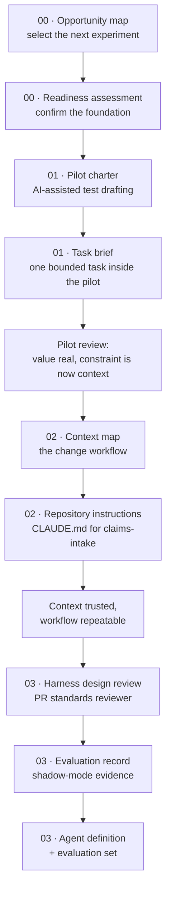

# Worked Examples

Every template in [templates/](../templates/) is blank by design. This directory holds one
filled instance of each, so a team can see what a completed artifact looks like before
producing its own.

> **These artifacts are fictional.** Harbour Mutual, its people, systems, and measurements
> are invented for illustration. Numbers are plausible, not observed. Do not cite them as
> evidence of what AI assistance achieves.

## The Running Scenario

The artifacts describe one organization moving through the journey over roughly six
months. They chain: the opportunity map selects the pilot, the pilot's review exposes a
context gap, the context work qualifies a workflow for a harness.

| Fact | Value |
| --- | --- |
| Organization | Harbour Mutual, a mid-size insurer |
| Function | Corporate IT, approximately 140 engineers |
| Pilot team | Claims Intake squad, 7 engineers |
| System | `claims-intake`, a Java 21 and Spring Boot service behind the claims portal |
| Data sensitivity | Policyholder personal data, claim documents; SOC 2 and privacy obligations apply |
| Executive sponsor | Director of Engineering, Corporate IT |
| Adoption lead | Staff Engineer, Claims Platform |

The scenario is deliberately ordinary and regulated. A team with sensitive data and real
review obligations exercises the governance guidance more honestly than a greenfield
project would.

## How the Artifacts Chain

## Directory Map

| Path | Template it fills | Horizon |
| --- | --- | --- |
| [00-start/sdlc-opportunity-map.md](00-start/sdlc-opportunity-map.md) | [sdlc-opportunity-map](../templates/sdlc-opportunity-map.md) | Before the first pilot |
| [00-start/adoption-readiness.md](00-start/adoption-readiness.md) | [adoption-readiness](../assessments/adoption-readiness.md) | Before the first pilot |
| [01-simple-integration/pilot-charter.md](01-simple-integration/pilot-charter.md) | [pilot-charter](../templates/pilot-charter.md) | Short term |
| [01-simple-integration/ai-task-brief.md](01-simple-integration/ai-task-brief.md) | [ai-task-brief](../templates/ai-task-brief.md) | Short term |
| [02-context-engineering/context-map.md](02-context-engineering/context-map.md) | [context-map](../templates/context-map.md) | Medium term |
| [02-context-engineering/repository-instructions.md](02-context-engineering/repository-instructions.md) | Repository instructions context product | Medium term |
| [03-harness-engineering/harness-design-review.md](03-harness-engineering/harness-design-review.md) | [harness-design-review](../templates/harness-design-review.md) | Long term |
| [03-harness-engineering/evaluation-record.md](03-harness-engineering/evaluation-record.md) | [evaluation-record](../templates/evaluation-record.md) | Long term |
| [03-harness-engineering/agents/pr-standards-reviewer.md](03-harness-engineering/agents/pr-standards-reviewer.md) | Harness task contract, as an agent definition | Long term |
| [03-harness-engineering/evaluation-set/](03-harness-engineering/evaluation-set/) | The cases behind the evaluation record | Long term |

## Reading These Critically

Two things in the scenario are worth noticing because they are the common failure shapes,
not the success story:

- **The pilot's headline result is modest.** Test drafting time fell, but review effort
  rose, so net cycle time barely moved. The pilot is judged a success on a different
  basis — it identified the real constraint. A charter that only measured generation speed
  would have reported a false win.
- **The harness is not autonomous.** It posts advisory findings to a pull request and
  cannot merge, approve, or modify code. That is the constrained-action stage, not the end
  state, and the design review records what would have to be true to go further.

[Templates](../templates/) | [Journey guide](../docs/journey-to-ai-native-sdlc.md) | [Back to the repository overview](../README.md)
